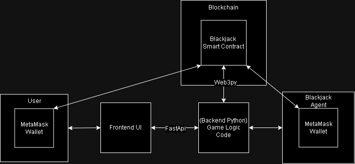
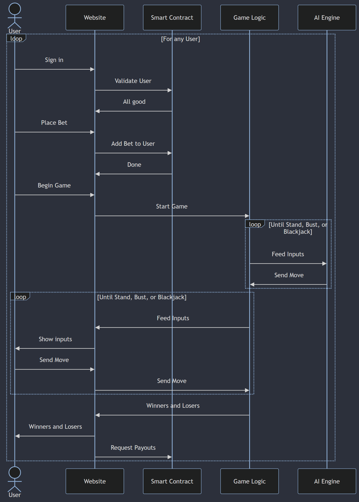

# F23_Blackjack_AI
*Ryan Karch (karchr), Dominic Beyer (beyerd), Angelica Loshak (loshaka), Michael Dong (dongm2)*

## Running Instructions
### Final Product
To run the final product follow these steps:
- Pull the most recent changes from main
- Run main.py exactly as is
  - main.py takes a single command line argument: the port to host the website on
  - If no argument is given, the website will be hosted on port 8000.
- Visit http://127.0.0.1:8000
- When opening the site you will be prompted to connect your Sepolia MetaMask account.
- On the login screen you can enter your name, check your balance and transfer Wei in and out of your blackjack account
- Once you have at least 10 Wei in your account and have set your name you can click proceed to advance into the game itself
- To begin you must increase your bet and lock it in with the bet button
- Then, hit the deal button to begin the game
- Once your cards are dealt you can hit until you either bust or decide to stand
- The AI and Dealer will then play
- The results of your game will be displayed on the screen, and you will be prompted to sign a MetaMask transaction to save your new balance to the smart contract
- To play another round, simply begin to bet
  - Please note that you will not be allowed to proceed until your transaction has been completed
- To cashout your winnings, refresh the page or return to the login page and use the withdraw functionality
### Development Testing
- Blockchain code:
  - The contract is hosted on RemixIDE
  - The [most up to date code](https://github.com/AI-and-Blockchain/F23_Blackjack_AI/blob/main/blockchain/BlackjackBettingContract.sol) is saved in the blockchain directory
  - This directory also contains the contract address in [address.txt](https://github.com/AI-and-Blockchain/F23_Blackjack_AI/blob/main/blockchain/address.txt)
  - Using these two files, once can connect to the smart contract in Remix and directly interact with it
- All code (frontend and backend) must be run through main.py, test.py or a similar .py file from the top level directory.
  - test.py contains two starter functions for individual testing:
    - game_test() will simulate a frontend server in a terminal environment that allows the tester to view states of the game as it progresses
    - web_test() will launch the website in its current development state
      - Please note that at this point in our development, this is identical to the Final Product function

### Component Diagram

### Sequence Diagram

### AI Algorithms/Models

We will be using Q-learning as our algorithm.

#### Why Use Q-learning, and How Does it Work?

* Q-learning is a reinforcement-learning algorithm where a model can learn and improve its strategy over time.
* When the model makes a decision based on the current state of the environment, the Q-table is updated, and this affects the model's future decisions.
* The Q-table stores an action for each possible state of the environment - when a state is encountered, the corresponding action for that state is retrieved from the Q-table and executed, and its value is updated. The model chooses the action that provides the highest "reward".
* We can train the model, and then use its Q-table in our code, or we can train the model over time while it plays on our system.

### Blockchain Architecture
* Smart contract used for betting cryptocurrency against the Blackjack AI
    * Ensures that the outcomes of the betting are fair and secure
    * Enables trust between customer and the gambling service because blockchain is immutable
* Logic programmed using **Remix IDE** in **Solidity**
    * **SepoliaETH** used by users to make bets and receive payments
    * **MetaMask** Ethereum wallet is used to deploy smart contract 
* Users connect to smart contract through MetaMask
    * [web3.py](https://web3py.readthedocs.io/en/stable/) Python Library used to interact with the smart contract
    * Users will be prompted to login into their MetaMask wallet account
    * Smart contract will verify and send transactions between users using their Ethereum address
